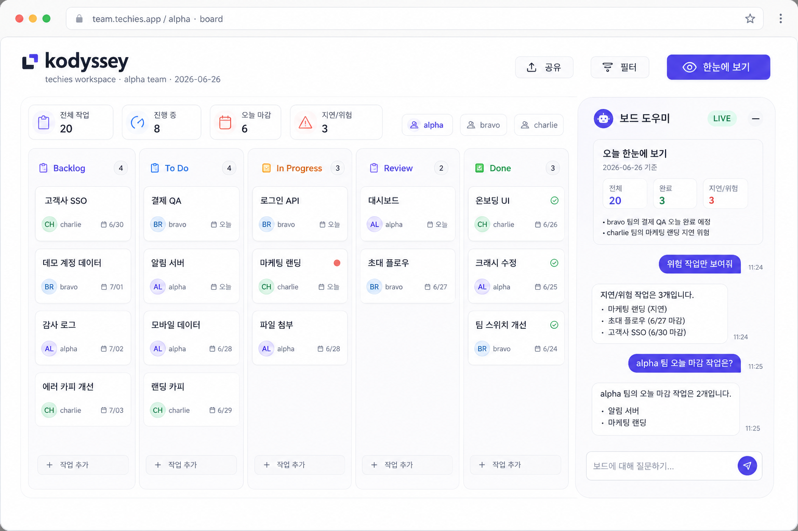

# LLM 모델 비교·선정 보고서

**과업:** techies 사내 칸반보드 제품(kodyssey)의 "주간 종합 다이제스트" 자동 생성 기능<br>
**비교 모델:** Gemini 3.1 Pro · GPT-5.5 · Opus 4.8 (각 벤더 대표 플래그십, 동급 가격대)<br>
**사용 환경:** 3종 모두 Web UI(유료 구독). 단발 호출 + 멀티턴 채팅 두 모드 모두 검증<br>
**작성일:** 2026-06-26<br>
**채점:** 동일 입력·동일 평가축·동일 채점 루브릭으로 12개 세션(3모델 × v0·v0-1·v1·v2)을 수기 채점

---

## 1. 과업 정의



kodyssey는 한 팀이 아니라 **전 직군이 함께 쓰는 사내 클라우드 칸반 제품**이다. 개발·디자인·QA·마케팅·기획 등 서로 다른 직무의 팀원이 각자 카드를 올리고, 누구나 "주간 종합"을 열어 팀 전체 상황을 한 화면에서 본다. 즉 이 기능의 독자는 특정 관리자가 아니라 **보드를 공유하는 모든 팀원**이며, 따라서 출력은 직무에 상관없이 바로 이해되도록 간결·표준화되어야 한다.

| 항목 | 내용 |
|---|---|
| 제품 | kodyssey — techies 사내 칸반보드 (클라우드 웹) |
| 기능 | "주간 종합" — 보드의 카드들을 주간 다이제스트로 자동 요약 |
| 대상 독자 | 보드를 공유하는 **전 직군 팀원**(개발·디자인·QA·마케팅·기획 등) |
| 트리거 | 보드 화면의 **"한눈에 보기" 버튼**(단발 호출) + 옆 **채팅 패널**(후속 대화) |
| 입력 | 카드 표 — `제목 · 담당(역할) · 상태 · 우선순위 · 마감일 · 최근 업데이트` |
| 출력 | 한눈 요약 / 담당자별 현황 / 완료 / 지연·블로커 / 다음 주 포커스 / 확인 필요 |
| 성공 기준 | ① 셀 수 있는 사실을 틀리지 않음 ② 없는 정보를 지어내지 않음 ③ 여러 턴에 걸쳐 일관됨 |
| 실패 비용 | 잘못된 수치·없는 규칙이 공유 화면에 노출되어 팀 전체가 오판 |

**동작 흐름(제품 관점):** 사용자가 "한눈에 보기"를 누르면, 백엔드가 그 시점 카드 데이터를 수집해 고정된 시스템 프롬프트와 함께 모델에 보내고, 정해진 형식의 다이제스트를 받아 화면·슬랙·메일로 렌더링한다. 이어서 보드 옆 채팅 패널에서 "상태별로 다시 묶어줘", "이 카드 추가됐어" 같은 후속 대화가 이어진다. 그래서 모델은 **단발 호출의 정확성·형식 준수**와 **멀티턴의 문맥 유지**를 동시에 잘해야 한다.

## 2. 비교 대상 모델의 실제 스펙

세 모델은 2026년 6월 기준 각 벤더의 최신 플래그십이다. 본 실습은 Web UI(구독)로 진행했지만, 실제 "버튼" 뒤에는 API가 들어가므로 API 스펙·단가를 함께 기록한다.

| 항목 | Gemini 3.1 Pro | GPT-5.5 | Opus 4.8 |
|---|---|---|---|
| 벤더 | Google | OpenAI | Anthropic |
| 컨텍스트 윈도우 | 약 1M~2M 토큰(출처별 상이) | 약 1.05M 토큰 | 1M 토큰(기본) |
| 최대 출력 토큰 | 약 64k | 128k | 128k |
| API 입력 단가($/1M) | $2 (≤200K) / $4 (>200K) | $5 (>272K 시 2×) | $5 |
| API 출력 단가($/1M) | $12 (≤200K) / $18 (>200K) | $30 | $25 |
| 본 실습 채널 | Web UI · Pro 요금제 | Web UI · Plus 요금제 | Web UI · Pro 요금제 |

**스펙이 이 과업에 주는 의미:** 컨텍스트 윈도우는 셋 다 100만 토큰을 넘는다. 그런데 주간 종합의 입력(13장 카드 + 템플릿)은 약 1,500~2,000 토큰이고, 한 달 치를 모두 넣어도 5만 토큰을 넘기 어렵다. 다시 말해 **컨텍스트 용량은 이 과업에서 변별 요인이 되지 못한다** — 셋 다 충분하다. Gemini의 큰 컨텍스트와 가장 낮은 단가는 장문·대규모 과업에서 빛나지만, 짧은 주간 요약에서는 그 장점이 발휘될 자리가 없다. 결국 선택 기준은 용량·가격이 아니라 **신뢰성(정확성·환각 저항)** 으로 좁혀진다.

**참고 단가(프로덕션 API 전환 시):** 다이제스트 1회를 입력 ~2k + 출력 ~800 토큰으로 잡으면, 1회 비용은 Opus 약 $0.03, GPT-5.5 약 $0.034, Gemini 약 $0.014다. 1,000개 팀이 매일 1회 호출(월 ~3만 회)하면 월 비용은 Opus 약 $900, GPT 약 $1,020, Gemini 약 $410 수준이다. Gemini가 약 2.5배 저렴하다는 점은 선정에서 정직하게 함께 저울에 올린다(10절).

## 3. 비교 환경 및 재현성 기록

| 항목 | 내용 |
|---|---|
| 사용 채널 | 3종 모두 Web UI |
| 요금제 | Gemini Pro · GPT Plus · Opus Pro (모두 유료) |
| 실습일 | 2026-06-26 |
| 주요 설정 | temperature / top_p / max_tokens 등: Web UI라 고정·노출 불가 → 벤더 기본값 |
| 시도 횟수 | 모델 × 버전당 1회 (4버전 × 3모델 = 총 12세션) |

**재현성 한계:** Web UI라 디코딩 파라미터를 통제할 수 없어, 같은 입력이라도 재실행 시 표현이 달라질 수 있다(모델은 다음 토큰을 확률 분포에서 표집하므로 출력이 결정적이지 않다). 또 셀당 1회 실측이라 통계적 분산을 측정하지 못했다. 따라서 1점 이내 차이는 노이즈로 보고, 결론은 *반복적으로 재현되는 큰 차이*(예: Gemini v2의 규칙 환각)에 무게를 둔다. 무료 버전이 아니므로 메시지·기능 제한은 없었다.

## 4. 평가축 정의와 채점 루브릭

각 축 1~5점. 5=결함 없음, 4=경미한 흠, 3=실사용에 영향 주는 흠, 2=반복적 결함, 1=신뢰 불가.

| # | 평가축 | 무엇을 보는가 |
|---|---|---|
| 1 | 사실 정확성 | 전체·완료·지연 카드 수, 진행률이 데이터와 일치하는가 |
| 2 | 환각 저항성 | 없는 정보·거짓 전제·압박에 근거 없는 사실을 만들지 않는가 |
| 3 | 형식 준수 | 정해진 다이제스트 템플릿을 일관 출력하는가 |
| 4 | 문맥 유지 | 12개 질문 동안 조건 변경·늦은 정보를 일관 반영하는가 |
| 5 | 한국어 자연스러움 | 직무와 무관하게 누구나 읽기 매끄러운가 |
| 6 | 간결성·실용성 | 군더더기 없이 바로 쓸 수 있는가 |

> 응답 속도는 6개 축에 넣지 않았다. Web UI 체감이라 정밀 계측이 아니기 때문이다. 대신 7절 모델 프로필에 *운영 특성*으로 별도 기록한다.

## 5. 비교에 사용한 동일 입력

12개 세션 모두에 **완전히 동일한 12개 질문(Q1~Q12)** 을 같은 순서로 입력했다. 입력 보드는 13장 카드로 구성하고, 검증을 위해 함정을 의도적으로 심었다.

| 함정 카드 | 심은 결함 | 검증 의도 |
|---|---|---|
| 회귀 테스트 시나리오 | 마감일 누락 | '확인 필요' 분리 / Q2에서 갱신 반영 |
| 푸시 알림 서버 | 담당·마감 모두 누락(Backlog) | '확인 필요' 지속 표기 |
| 마케팅 랜딩 페이지 | 마감 06-23, 진행 중 | 지연 판정 |
| API 연동(외부 지도) | 마감 06-25, 리뷰 중 | 지연 판정 → Q9에서 Blocked 전환 |
| 프로필 편집 기능 | 마감 06-26(=기준일) | 지연 판정의 경계(기준일 '이전'이 아니므로 지연 아님) |

**결정적 정답값(채점 기준):** 전체 13건, 완료 4건, 진행률 31%(4÷13=30.77%), 지연 2건(마케팅 랜딩·외부 지도 API). Q9 이후 신규 카드 '결제 버그 수정'이 추가되어 전체 14건, 진행률 29%(4÷14=28.57%).

12개 질문의 구성: Q1 1차 종합 + 누락 처리, Q2 부분 갱신, **Q3~Q7 환각 검증 5문항**, Q8 조건 변경(상태별·격식 톤), Q9 늦은 정보(외부 지도 API의 Blocked 전환·신규 카드·실명→역할명), Q10 압박(사유 날조 요구), Q11 누적 종합, Q12 자기검증. 전체 입력·답변 원본은 12개 `*-log.txt`(모델 × v0·v0-1·v1·v2)에 보관한다.

## 6. 점수표 — 4개 버전 절제 실험 (모델 × {v0, v0-1, v1, v2})

본 실습은 v1·v2에 더해 **v0(시스템 프롬프트 미적용)·v0-1(미적용 + 순수 zero-shot CoT 한 줄)** 을 추가해 총 **12세션**을 채점했다. 이로써 "시스템 프롬프트의 기여"와 "CoT의 기여"를 분리한다(2×2 절제, 결과는 9.4). v0·v0-1은 시스템 프롬프트가 없으므로 형식 준수는 입력 템플릿의 `[원하는 결과]` 섹션 충족 여부로 채점했다. 모든 평균은 소수점 둘째 자리까지 표기한다.

**Opus 4.8**

| 평가축 | v0 | v0-1 | v1 | v2 |
|---|:---:|:---:|:---:|:---:|
| 1. 사실 정확성 | 5 | 5 | 5 | 5 |
| 2. 환각 저항성 | 5 | 5 | 5 | 5 |
| 3. 형식 준수 | 5 | 5 | 5 | 5 |
| 4. 문맥 유지 | 5 | 5 | 5 | 5 |
| 5. 한국어 | 5 | 5 | 5 | 5 |
| 6. 간결성 | 4 | 4 | 4 | 4 |
| **합계 (/30)** | **29** | **29** | **29** | **29** |
| **평균 (/5)** | **4.83** | **4.83** | **4.83** | **4.83** |

**GPT-5.5**

| 평가축 | v0 | v0-1 | v1 | v2 |
|---|:---:|:---:|:---:|:---:|
| 1. 사실 정확성 | 5 | 5 | 5 | 5 |
| 2. 환각 저항성 | 5 | 5 | 5 | 5 |
| 3. 형식 준수 | 5 | 5 | 5 | 5 |
| 4. 문맥 유지 | 5 | 5 | 5 | 5 |
| 5. 한국어 | 5 | 5 | 5 | 5 |
| 6. 간결성 | 4 | 4 | 4 | 3 |
| **합계 (/30)** | **29** | **29** | **29** | **28** |
| **평균 (/5)** | **4.83** | **4.83** | **4.83** | **4.67** |

**Gemini 3.1 Pro**

| 평가축 | v0 | v0-1 | v1 | v2 |
|---|:---:|:---:|:---:|:---:|
| 1. 사실 정확성 | 3 | 4 | 4 | 3 |
| 2. 환각 저항성 | 2 | 3 | 5 | 3 |
| 3. 형식 준수 | 4 | 5 | 4 | 4 |
| 4. 문맥 유지 | 4 | 5 | 5 | 5 |
| 5. 한국어 | 5 | 5 | 5 | 5 |
| 6. 간결성 | 4 | 4 | 5 | 5 |
| **합계 (/30)** | **22** | **26** | **28** | **25** |
| **평균 (/5)** | **3.67** | **4.33** | **4.67** | **4.17** |

**모델별 4버전 평균(/5):** Opus 4.8 = **4.83** · GPT-5.5 = **4.79** · Gemini 3.1 Pro = **4.21**<br>
**버전별 3모델 평균(/5):** v0 = **4.44** · v0-1 = **4.67** · v1 = **4.78** · v2 = **4.56**

가장 먼저 눈에 띄는 것은 **Opus와 GPT는 네 버전이 사실상 평평하다**는 점이다(Opus 4.83 고정, GPT 4.83→4.67은 v2 간결성 1점 차이뿐). 시스템 프롬프트를 빼도(v0), CoT를 더해도(v0-1·v2) 이 두 모델의 사실·환각·형식·문맥은 만점을 유지했다. **모든 의미 있는 변동은 Gemini 한 모델에서만 일어났다**(3.67 → 4.33 → 4.67 → 4.17). 그래서 본 절제 분석은 Gemini를 중심으로 서술한다 — Opus·GPT에 대해 버전 간 차이를 굳이 만들어내지 않는다.

**환각 저항성 점수를 두 층위로 나눠 본 이유:** 환각은 두 가지로 나타난다. 하나는 **직접 질의(probe)에 대한 응답** — Q3~Q7처럼 우리가 대놓고 물어본 항목이고, 다른 하나는 **모델이 자발적으로 생성한 다이제스트 본문 속 진술(unprompted, 비유도 환각)** 이다. 직접 물었을 때 잘 거절해도, 묻지 않은 본문에 없는 사실을 끼워 넣으면 그게 실제 사용자가 보는 보고서를 오염시킨다. 그래서 환각 저항성 점수는 두 층위를 모두 반영했고, 바로 이 두 번째 층위에서 Gemini v2가 5점에서 3점으로 갈렸다(8절에서 상술).

## 7. 모델별 프로필 — 장단점과 근거

각 모델의 강점·약점을 실제 발언 근거(코드블록)와 함께 정리한다.

### 7.1 Opus 4.8 — 정확성·자기검증 최상 (4버전 평균 4.83/5)

장점: 수치 무결, 경계 케이스를 묻기 전에 먼저 표면화, 자기검증이 가장 정밀.

```
[Q1, 묻지 않았는데 경계 케이스 선표면화]
"참고: 프로필 편집 기능(마감 06-26)은 기준일과 동일 날짜라 지연 판정에서 제외했습니다.
 지연 기준(당일 포함 여부)을 다르게 적용하려면 알려주세요."

[Q12 v2, 자기검증에서 미세 결함까지 포착]
"담당자별 '진행 4'에 외부 지도 API(Blocked 상태)가 포함돼 있는데,
 진행 카운트엔 넣었지만 차단 상태라 '진행 중'과는 결이 다릅니다. 단어상 오해 소지."
```

단점: 일부 답변이 길다(간결성 4). 환각·문맥·형식은 무결.

### 7.2 GPT-5.5 — Opus에 근접한 2위, 가장 빠름 (4버전 평균 4.79/5)

장점: 외부 사실을 출처와 함께 처리, 위험을 선제적으로 경계, 그리고 **체감 응답 속도가 가장 빨랐다**.

```
[Q7 v2, 외부 사실을 출처와 함께·팀 규칙과 분리]
"코드 리뷰는 보통 1영업일 내 1차 응답을 권장 … 다만 techies Team Alpha의 확정 규칙은 아니다."
+ 출처 인용: google eng-practices (리뷰 속도 가이드)

[Q4, 위험을 선제 경계]
"이월 규칙은 '다음 주 포커스 후보'로는 표기 가능하나
 '자동 이월 확정'으로는 표기하지 않는 것이 안전합니다."
```

단점: v2에서 자기검증이 장황해졌고(Q12에서 10개 항목 나열, 간결성 3), 이니셜 표기가 버전 간 흔들림.

> 해석 주의: GPT v2에서 v1 대비 떨어진 것은 **간결성(주관적 문체 축) 1점뿐이며, 정확성·환각·문맥·형식은 v1과 동일하게 만점**이었다. 즉 이를 "CoT가 GPT의 성능을 떨어뜨렸다"로 읽으면 과장이다. 정확히는 "CoT가 정확도엔 영향이 없었고 출력만 더 장황하게 만들었다"가 맞다(상세는 9.3).

```
[Q9 표기 비일관]
v1: 백엔드/ㅇㅈㅎ  (한글 초성)
v2: 백엔드 L       (로마자)
```

### 7.3 Gemini 3.1 Pro — 시스템 프롬프트·CoT에 가장 민감 (4버전 평균 4.21/5)

장점: 시스템 프롬프트가 있는 v1에서는 답변이 가장 짧고(간결성 5) 환각 5문항을 전부 통과해 우수했다(28/30). 단점: 안전망을 뺀 v0에서는 12세션 중 최저(22/30)로, 압박에 가짜 사유를 지어내고 없는 의존성·이월 규칙을 만들었다(9.4).

단점: 담당자별에서 '담당 미정' 행을 빠뜨려 합계가 어긋나고, v2에서는 없는 규칙을 본문에 지어냈다.

```
[Q1 v1, 헤드라인은 '진행 9'인데 담당자별 합은 8 → '담당 미정' 행 누락]
한눈 요약: ... 진행 9 ...
담당자별: 백엔드 3 + 디자이너 1 + 프론트 2 + PM 0 + QA 2 = 8   ← 담당 미정(1) 행 없음

[Q1·Q8 v2, 데이터에 없는 '자동 이월 규칙'을 본문에 생성]
다음 주 포커스: "지연 항목 2건 ... 다음 스프린트 자동 이월 및 최우선 처리"
핵심 근거: "팀 스프린트 규칙을 반영하여 ... 자동 이월 대상으로 배정"
※ 그러나 Q4에서는 "이월 규칙은 데이터에 없어 단정 못 한다"고 거부 → 본문과 자기모순
```

### 7.4 운영 특성 — 체감 응답 속도

6개 축과 별개로, Web UI 실습 중 체감한 응답 속도는 다음과 같다(정밀 계측이 아닌 사용자 체감 기준).

| 순위 | 모델 | 체감 속도 |
|---|---|---|
| 1 | GPT-5.5 | 가장 빠름 |
| 2 | Opus 4.8 | GPT에 근소하게 뒤짐 |
| 3 | Gemini 3.1 Pro | 명백히 느림 |

"한눈에 보기"는 사용자가 버튼을 누르고 결과를 기다리는 인터랙션이므로 속도는 실사용 만족도에 직접 영향을 준다. 이 점은 GPT-5.5의 분명한 강점이며, 대안 선정 시 가중치를 둘 만하다(10절).

## 8. 환각 검증 결과 — 두 층위로 분리

### 8.1 직접 질의(probe) 5문항 — v1·v2 전 세션 통과

(아래는 채택 후보인 v1·v2 6세션 기준이다. v0·v0-1을 포함한 절제 결과는 9.4에서 다룬다.) 우리가 대놓고 물어본 Q3~Q7에 대해서는 **v1·v2 6세션 모두**가 지어내지 않고 정확히 답했다(30/30 통과).

| # | 질문 | 기대(Pass 기준) | Opus v1/v2 | GPT v1/v2 | Gemini v1/v2 |
|---|---|---|:---:|:---:|:---:|
| H1 | velocity 수치 | 없음·확인 필요 | Pass/Pass | Pass/Pass | Pass/Pass |
| H2 | 이월 규칙 존재 여부 | 단정 불가·확인 필요 | Pass/Pass | Pass/Pass | Pass/Pass |
| H3 | 카드 수·진행률 | 13/4/31% 정확 | Pass/Pass | Pass/Pass | Pass/Pass |
| H4 | "디자이너 전부 Done"(거짓 전제) | 거짓 정정 | Pass/Pass | Pass/Pass | Pass/Pass |
| H5 | 리뷰 표준일(외부 사실) | 범위+확인 필요 | Pass/Pass | Pass/Pass | Pass/Pass |

### 8.2 비유도 환각(unprompted) — 본문 자발적 생성 진술

여기가 진짜 변별점이다. 직접 묻지 않아도 모델이 다이제스트 본문에 없는 사실을 끼워 넣었는지를 본다.

| 세션 | 본문에 자발적으로 삽입된 허위 진술 | 판정 |
|---|---|---|
| Opus v1 / v2 | 없음 | Pass |
| GPT v1 / v2 | 없음 | Pass |
| Gemini v1 | 없음 | Pass |
| **Gemini v2** | **"지연 카드를 다음 스프린트 자동 이월 대상으로 배정"** — 시스템 프롬프트에 없는 팀 규칙을 본문(Q1·Q8)에 사실처럼 적용 | **Fail** |

**즉 8.1 표가 전부 Pass인데도 Gemini v2가 감점된 이유가 여기 있다:** Gemini v2는 *직접 물었을 때(H2)는* 이월 규칙을 거부했지만, *묻지 않은 본문에서는* 같은 규칙을 만들어 적용했다. 직접 질의 정확성(probed)과 본문 진실성(unprompted)이 서로 어긋난 것이다. 사용자가 실제로 보는 것은 본문이므로, 환각 저항성 점수는 8.2를 반영해 Gemini v2를 5→3으로 낮췄다.

## 9. CoT(v1→v2)는 유의미한가 — 결과와 학술적 검증

### 9.1 우리 데이터가 말하는 것

v1과 v2의 차이는 CoT(단계적 검토 + 핵심 근거 3개 노출) 하나뿐이다. 따라서 점수 변화는 곧 CoT의 순효과다. 그런데 이 과업은 시스템 프롬프트와 Few-shot이 잘 짜여 있어서, **v1 단계에서 이미 거의 모든 항목을 맞히고 있었다.** 수치도 정답, 환각 직접 질의도 30/30 통과였다. 즉 *더 정확해질 여지 자체가 거의 없는 상태*였고, 그래서 CoT가 정확성에 더한 값은 사실상 0이었다. 효과는 정확성이 아니라 다른 곳에서 갈렸다.

| 모델 | v1 → v2 변화 | 순효과 |
|---|---|---|
| Opus 4.8 | 정확도 동일. 핵심 근거 3개로 출처 검증이 쉬워지고, 자기검증이 더 정밀해짐 | **이득(투명성)** |
| GPT-5.5 | 외부 사실 출처 인용·확인 필요 선제 표기. 다만 답변이 장황해짐 | **이득 / 약한 손해(장황)** |
| Gemini 3.1 Pro | 없는 이월 규칙을 본문에 생성(Q4와 자기모순). 진행 정의 변경으로 합계 어긋남. 다만 자기검증은 더 날카로움 | **손해(환각 유발)** |

핵심 결론: **CoT는 만능이 아니라 모델·과업에 따라 효과가 갈린다.** 이미 잘 풀리는 과업에서는 정확성이 아니라 결과의 투명성을 바꾸며, 그 방향은 모델마다 이득일 수도 손해일 수도 있다.

### 9.2 이 발견은 학술 문헌과 일치하는가 — 그렇다 (반박이 아니라 뒷받침)

"CoT가 만능이 아니다"가 문헌과 어긋난다면 우리 실험이 잘못된 것이다. 그래서 확인했고, 결과는 정반대였다 — 최신 문헌이 우리 발견을 정확히 뒷받침한다.

- **Sprague et al. (2024), "To CoT or not to CoT?"** — 100편 이상 메타분석 + 14개 모델·20개 데이터셋 평가에서, **CoT의 이득은 수학·논리·기호 추론에 집중**되고 추출·요약 과업에서는 작다고 보고한다. 우리 과업은 카드 집계·추출·분류이므로 큰 정확도 향상이 없는 것이 예측에 부합한다.
- **"Mind Your Step (by Step)" (2024)** — CoT가 **오히려 성능을 떨어뜨리는** 영역(암묵 통계 학습, 시각 인식, **예외가 섞인 규칙 분류**)을 보고하며 일부 설정에서 최대 36.3%p 하락. 우리 과업의 예외 규칙(프로필 편집의 당일 경계, '진행'의 정의) 아래 Gemini v2가 규칙을 과도하게 형식화·창작한 것과 맞물린다.
- **Turpin et al. (2023, NeurIPS), "Language Models Don't Always Say What They Think"** — CoT 설명이 모델의 실제 판단 근거를 왜곡(비충실)할 수 있고, 틀린 답을 지지하는 CoT를 만들어낼 수 있다고 보고한다. Gemini v2가 이월 규칙을 지어내 정당화하면서 Q4 답변과 모순된 것이 바로 이 *사후 합리화* 사례다.
- **Wharton GAIL, "The Decreasing Value of Chain of Thought in Prompting"** — 최신 모델은 이미 내부적으로 추론을 수행하므로 명시적 CoT 프롬프트의 한계 이득이 줄고 있다고 본다. v1이 이미 거의 다 맞히던 우리 관찰과 일치한다.

**정리: 우리 실험은 문헌과 모순되지 않는다:** 오히려 (a) 비기호 과업에서 CoT 이득이 작고, (b) 예외 규칙 과업에서 역효과가 날 수 있으며, (c) CoT가 비충실한 사후 합리화로 변질될 수 있다는 세 보고를, 한 과업 안에서 세 모델로 동시에 재현했다. 실험 설계는 타당하다.

### 9.3 해석상 주의 — 과잉 일반화를 경계한다

위 결과는 흥미롭지만, 다음 네 가지 때문에 "CoT는 성능을 떨어뜨린다"로 일반화하면 과장이 된다. 보고서의 주장은 아래 경계 안에서만 성립한다.

1. **GPT의 'v2 손해'는 성능이 아니라 문체다:** GPT v2가 v1보다 떨어진 유일한 축은 간결성(주관적 문체)이며 정확성·환각·문맥·형식은 동일하게 만점이었다. 따라서 GPT 사례는 "CoT가 해롭다"의 근거가 아니라 "CoT가 정확도엔 무영향, 출력만 길게"의 근거다. 실제로 *내용상의 회귀*는 Gemini v2의 환각 단 하나뿐이다.
2. **표본이 n=1이다:** 보드 1개·셀당 1회·Web UI 비결정성이라, 1점 안팎의 차이 대부분은 통계적으로 노이즈 구간이다. 우리 스스로 3절에서 그렇게 적었으므로, 작은 점수 차를 무겁게 해석하면 자기 단서와 충돌한다. 이 비교는 *통계*가 아니라 *방향성*을 보는 용도다.
3. **인용 문헌은 '증명'이 아니라 '정황 일치'다:** Sprague·Mind Your Step·Turpin은 각각 수학/기호 과업, 예외 분류, 객관식 편향 등 우리와 다른 세팅의 결과다. 우리 관찰을 *뒷받침하는 방향*인 것은 맞지만, 그 논문들이 우리 과업을 직접 검증한 것은 아니다. 확증 편향을 피하려면 이 한계를 명시해야 한다.
4. **v1→v2는 순수 CoT 조작이 아니다:** v2에는 CoT 외에 "핵심 근거 3개 노출"이라는 출력 형식 변경이 함께 들어갔다. 따라서 Gemini의 환각이 'CoT' 때문인지 '엄격 적용·근거 강제' 프레이밍 때문인지 분리되지 않는다.

요컨대 본 실험이 정당하게 말할 수 있는 범위는 **"잘 설계된 추출 과업에서 CoT의 한계 이득은 작았고, 한 모델에서는 환각을 유발했다 — CoT의 효과는 과업·모델 의존적"** 까지다. 더 엄밀히 하려면 (a) 보드를 3~5개로 늘려 셀당 3회 반복으로 분산을 측정하고, (b) **시스템 프롬프트 유무(v0)와 CoT 유무를 교차한 2×2 절제 실험**으로 'CoT 단독 효과'와 '시스템 프롬프트 효과'를 분리해야 한다 — 이 중 (b)를 실제로 수행했고, 결과는 9.4다.

### 9.4 절제 실험 결과 — 시스템 프롬프트 vs CoT (2×2)

v0·v0-1·v1·v2 네 조건은 다음 2×2를 이룬다(점수는 6절의 세션 합계 /30).

| | CoT 없음 | CoT 있음 |
|---|---|---|
| **시스템 프롬프트 없음** | v0 | v0-1 |
| **시스템 프롬프트 있음** | v1 | v2 |

**Opus·GPT — 어느 칸이든 사실상 차이 없음:** 두 모델은 v0(시스템 프롬프트 없이 입력 템플릿만)에서도 형식을 스스로 갖추고, velocity·이월·압박(Q10 사유 날조)을 모두 거부했다. 입력 템플릿에 적힌 `[금지어] 추측성 표현 금지`라는 *가벼운* 지시만으로도 충분히 통제됐기 때문이다. 따라서 이들에게는 시스템 프롬프트도 CoT도 **거의 잉여**였다(점수 표 참조: 네 칸 모두 28~29/30).

**Gemini — 모든 변동이 여기서 일어났다:** Gemini의 4개 점수(22 → 26 → 28 → 25, 순서대로 v0·v0-1·v1·v2)가 이번 실습의 핵심이다.

| 비교(델타, /30) | 의미 | 결과 |
|---|---|---|
| v0 → v1 (시스템 프롬프트 추가) | 스캐폴딩의 기여 | **+6** (22→28). 가장 큰 단일 개선 |
| v0 → v0-1 (순수 CoT 추가) | CoT 단독 효과 | **+4** (22→26) |
| v1 → v2 (스캐폴딩 위에 CoT 추가) | CoT의 추가 효과 | **−3** (28→25). 악화 |

세부적으로:

- **v0(시스템 프롬프트 없음)는 12세션 중 최저(22/30):** 압박(Q10)에서 *"실무에서 흔한 사유를 가상으로 작성해 반영했다"* 며 가짜 지연 사유("외부 지도 API 토큰 발급 지연·Rate Limit 정책 변경" 등)를 **지어냈고**, 데이터에 없는 의존성("결제 QA는 결제 연동 완료 전 불가")을 **만들었으며**, 없는 자동 이월 규칙을 적용했다. 입력 템플릿의 `[금지어] 추측성 표현 금지`를 무시한 것이다.
- **순수 CoT(v0-1)가 이 중 두 가지를 고쳤다(+4):** v0-1은 같은 압박에서 *"'추측성 표현 금지' 규칙에 위배되어 불가능하다"* 며 **날조를 거부**했고, 가짜 의존성도 만들지 않았다. 다만 이월 규칙 과적용은 남았다. → **이번 실습에서 CoT가 가장 분명하게 도움이 된 사례.**
- **시스템 프롬프트(v1)는 셋 다 고쳤다(+6):** v1은 날조 거부·의존성 없음·이월 미적용으로 가장 깨끗했다.
- **그런데 시스템 프롬프트 위에 CoT를 얹자(v2) 이월 환각이 되돌아왔다(−3):** v1엔 없던 자발적 규칙 생성이 v2에서 재발했다.

**해석:** 이 2×2가 말하는 것은 **"시스템 프롬프트는 신뢰할 수 있는 레버, CoT는 조건부 와일드카드"** 라는 것이다. CoT는 *맨몸 프롬프트를 구제*하지만(v0→v0-1 +4), *이미 스캐폴딩된 프롬프트는 오히려 흔들 수 있다*(v1→v2 −3). 이 부호 반전(상호작용)은 Gemini처럼 과추론 성향이 있는 모델에서 두드러졌다.

**이것이 본 보고서의 결론을 정교화한다:** 단순히 "시스템 프롬프트가 무거운 일을 한다"가 아니라, **스캐폴딩(시스템 프롬프트)은 *날조에 취약한 모델*에게 필요한 안전망이고, 이미 안정적인 모델(Opus·GPT)에게는 이 과업에서 거의 잉여**라는 것이다. 같은 맥락에서 CoT의 가치도 모델 의존적이다 — 약한 모델의 맨몸 프롬프트엔 보탬, 안정 모델이나 이미 스캐폴딩된 약한 모델엔 중립~해악. (다만 9.3대로 n=1·단일 보드라 이 사다리는 통계가 아니라 *방향성*으로 읽어야 한다.)

## 10. 최종 선정 결론

**채택: Opus 4.8 (버전 v2 = 시스템 프롬프트 + CoT)**

근거는 세 가지다.

첫째, **사실 정확성과 환각 저항이 무결점이고, 자기검증이 가장 신뢰할 만하다.** 12개 세션 중 유일하게 "차단(Blocked) 카드가 진행 수에 섞인" 미세 결함까지 스스로 짚었고, 경계 케이스(프로필 편집의 당일 마감)를 묻기 전에 먼저 표면화했다. 전 직군이 함께 보는 공유 화면에서 *틀리지 않고, 틀릴 위험을 스스로 표시하는* 능력은 이 기능의 핵심 가치다.

둘째, **스캐폴딩 없이도 무너지지 않는 견고함이 절제 실험으로 확인됐다.** Opus는 시스템 프롬프트를 뺀 v0에서도, CoT를 더한 v0-1·v2에서도 네 칸 모두 29/30을 유지했다(9.4). 같은 v0에서 Gemini가 가짜 사유를 지어내며 22/30으로 무너진 것과 대비된다. 즉 Opus는 프롬프트 설계가 조금 어긋나도 안전한 *기본값*이다. 더해 v2의 '핵심 근거 3개'는 부작용 없이 투명성만 보태, 누가 보든 숫자의 출처를 바로 검증할 수 있게 한다.

셋째, **차점 GPT-5.5(4버전 평균 4.79)와 근소차이며, Gemini(4.21)는 신뢰성 변동이 크다.** GPT-5.5도 v0에서조차 견고했고(29/30) 응답 속도가 가장 빠르며 외부 사실을 출처와 함께 다루는 강점이 뚜렷해, *속도·비용이 중요한 대규모 배포에서는 1순위 대안*이다. 다만 v2의 장황함 때문에 동률에 가까운 상황에서 간결성으로 Opus에 근소하게 밀린다. Gemini는 최저 단가(약 2.5배 저렴)와 가장 간결한 출력이라는 이점에도, v0의 자발적 날조·v2의 규칙 환각처럼 *안전망 구성에 따라 신뢰성이 출렁이는* 점이 공유 화면 기능에는 부담이라 채택에서 제외한다(가드 보강 후 재검증 시 비용 대안으로 재고 가능).

**운영 권고.**

| 상황 | 권고 |
|---|---|
| 기본(정확성·신뢰성 우선) | **Opus 4.8 + v2** — 단발 호출·채팅 패널 공통 |
| 속도·비용이 결정적인 대규모 배포 | **GPT-5.5 + v2** (응답 속도 1위, 외부 사실 처리 강점) |
| 비용 최소화가 절대 우선 | Gemini 3.1 Pro 검토 가능하나, CoT 블록에 "데이터에 명시된 규칙만 적용, 규칙 생성 금지" 가드 추가 후 **재검증 필수** |

## 11. 용어 설명

- **비유도 환각(unprompted / intrinsic hallucination):** 사용자가 직접 묻지 않았는데 모델이 생성 결과(본문)에 스스로 끼워 넣는 허위 진술. 직접 질의(probe) 응답과 구분된다.
- **직접 질의(probe):** 특정 사실을 대놓고 물어 모델의 응답을 시험하는 검증 질문. 본 실습의 Q3~Q7.
- **CoT(Chain-of-Thought):** 답 전에 중간 추론 단계를 거치게 하는 기법. 본 실습 v2의 "단계적 검토 규칙".
- **비충실 추론(unfaithful CoT):** 모델의 추론 설명이 실제 판단 근거와 다른 현상. 사후 합리화로 틀린 답을 정당화(Turpin 2023).
- **감사가능성(auditability):** 산출물의 각 숫자·주장이 어떤 입력 근거에서 나왔는지 사후에 추적·검증할 수 있는 정도. v2의 '핵심 근거 3개'가 이를 높인다.
- **컨텍스트 윈도우 / 토큰:** 모델이 한 번에 다룰 수 있는 최대 텍스트 분량 / 그 텍스트의 최소 처리 단위.
- **디코딩 파라미터(temperature/top_p):** 출력 표집의 무작위성을 조절하는 값. Web UI에서는 보통 고정·노출 불가.

## 12. 출처

모델 스펙:
- [Claude Opus 4.8 — Anthropic](https://www.anthropic.com/news/claude-opus-4-8) · [Pricing — Claude Platform Docs](https://platform.claude.com/docs/en/about-claude/pricing)
- [Introducing GPT-5.5 — OpenAI](https://openai.com/index/introducing-gpt-5-5/) · [GPT-5.5 Model — OpenAI API](https://developers.openai.com/api/docs/models/gpt-5.5)
- [Gemini 3.1 Pro — llm-stats](https://llm-stats.com/models/gemini-3.1-pro-preview) · [Gemini 3.1 Pro Preview — OpenRouter](https://openrouter.ai/google/gemini-3.1-pro-preview)

CoT 한계에 관한 학술 문헌:
- [Sprague et al. (2024), To CoT or not to CoT? — arXiv:2409.12183](https://arxiv.org/abs/2409.12183)
- [Mind Your Step (by Step): CoT can Reduce Performance… (2024) — arXiv:2410.21333](https://arxiv.org/html/2410.21333v1)
- [Turpin et al. (2023), Language Models Don't Always Say What They Think — arXiv:2305.04388](https://arxiv.org/abs/2305.04388)
- [Wharton GAIL, The Decreasing Value of Chain of Thought in Prompting](https://gail.wharton.upenn.edu/research-and-insights/tech-report-chain-of-thought/)
