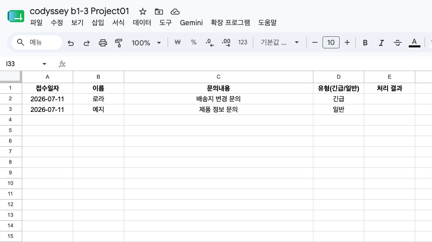
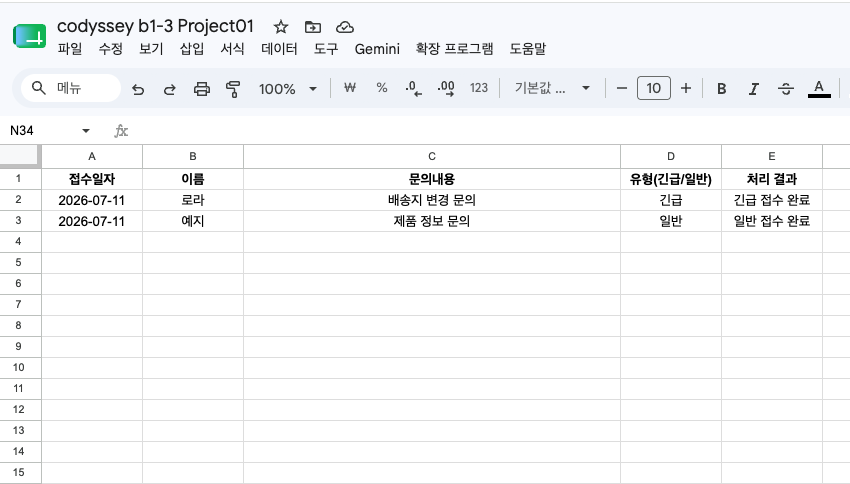
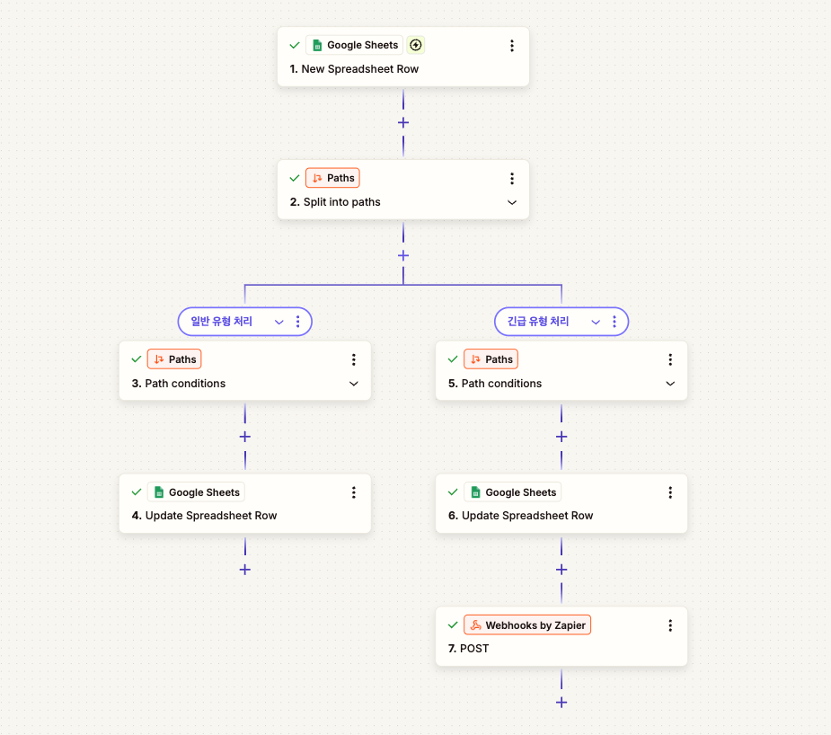
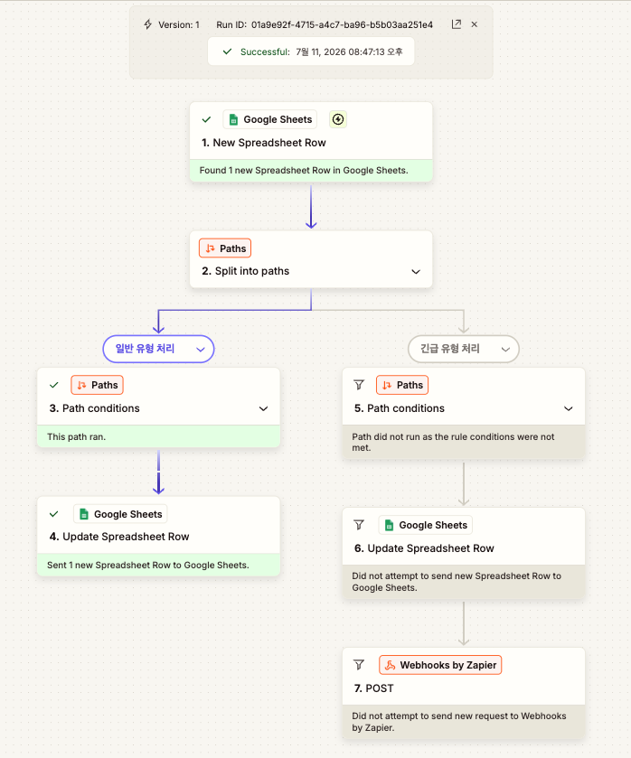
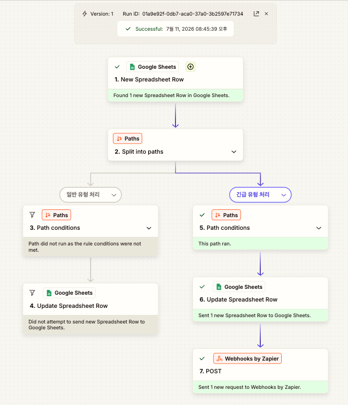
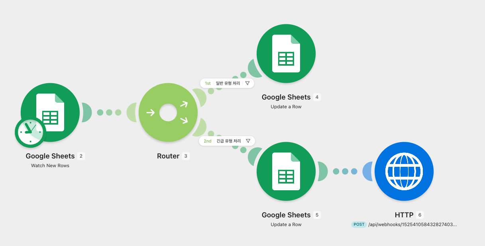
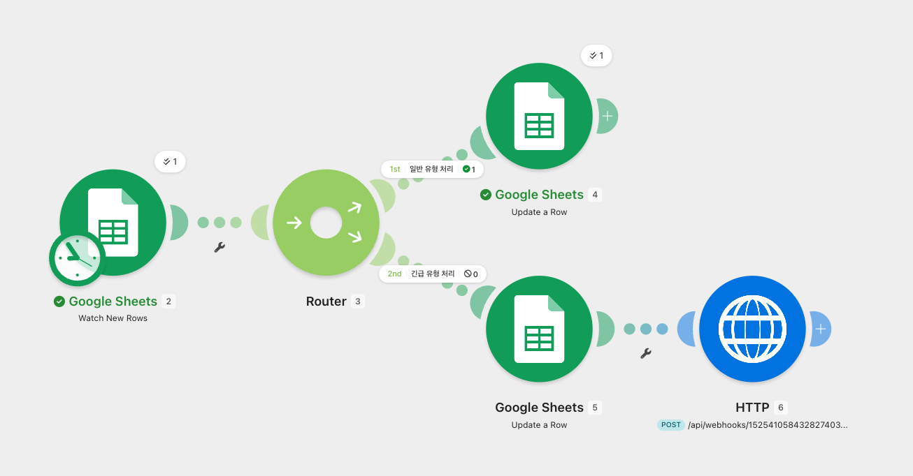
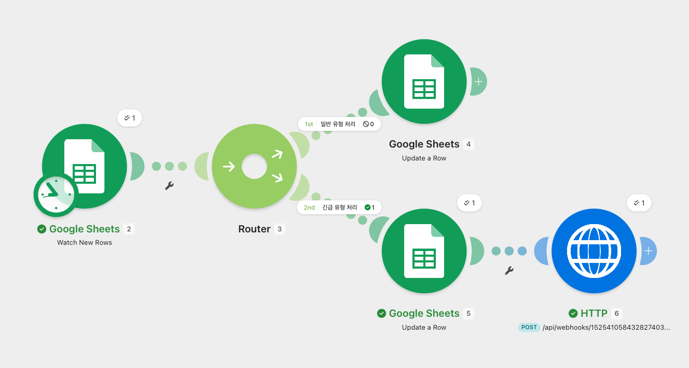
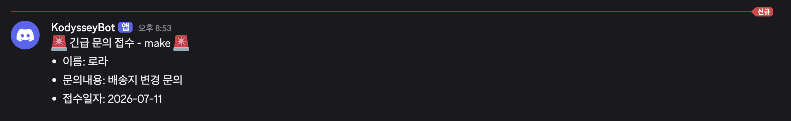

# 자동화 도구 비교 구현 보고서 (Make vs Zapier)

## 1. 개요

**사용한 도구**: Make, Zapier (Professional 14일 무료 트라이얼)

**구현한 워크플로우**: Google Sheets에 새로운 문의가 접수되면, 문의 유형(긴급/일반)에 따라 자동으로 처리 결과를 분기 처리하는 자동화

```
Trigger: Google Sheets '문의' 시트에 새 행 추가
   ↓
Router / Paths: '유형(긴급/일반)' 컬럼 값 기준 2-way 분기
   ├─ 일반 유형 처리 → Google Sheets 해당 행 '처리 결과'에 "일반 접수 완료" 기록
   └─ 긴급 유형 처리 → ① Google Sheets 해당 행 '처리 결과'에 "긴급 접수 완료" 기록
                    ② Discord 채널에 긴급 알림 전송
```

동일한 워크플로우 구조를 Make와 Zapier 양쪽에서 각각 구현하고, 실제로 두 분기(일반/긴급)가 모두 정상 실행되는 것까지 확인했다.

## 2. 공통 데이터 소스: Google Sheets

두 도구가 동일한 스프레드시트(`codyssey b1-3 Project01` / `문의` 시트)를 트리거 및 액션 대상으로 공유했다.

**자동화 실행 전 — '처리 결과' 컬럼이 비어 있는 상태**



**자동화 실행 후 — 유형별로 처리 결과가 자동 기록된 상태**



로라(긴급)는 "긴급 접수 완료", 예지(일반)는 "일반 접수 완료"로 각 분기 로직에 맞게 자동 기록된 것을 확인할 수 있다.

## 3. Zapier 구현

### 3-1. 구현 과정 요약

1. 신규 계정으로 가입해 14일 Professional 트라이얼(카드 등록 없이 자동 적용)로 진행
2. Trigger: Google Sheets **"New Spreadsheet Row"**
3. **Paths by Zapier**로 2-way 분기 구성 (일반 유형 처리 / 긴급 유형 처리)
4. 일반 경로: Google Sheets **"Update Spreadsheet Row"** 액션 1개
5. 긴급 경로: Google Sheets **"Update Spreadsheet Row"** → **Webhooks by Zapier(POST)** 액션 2개 연결, POST 요청으로 Discord 웹훅에 메시지 전송

### 3-2. 워크플로우 구성 화면



### 3-3. 실행 결과 — 일반 유형 분기

'일반 유형 처리' Path가 실행되어 Google Sheets 업데이트까지 성공(초록색)했고, '긴급 유형 처리' Path는 조건이 맞지 않아 실행되지 않은(회색) 것이 로그에 그대로 남아 분기 로직이 의도대로 동작함을 확인할 수 있다.



### 3-4. 실행 결과 — 긴급 유형 분기

반대로 '긴급 유형 처리' Path가 실행되어 Google Sheets 업데이트와 Discord Webhook 전송까지 모두 성공했고, '일반 유형 처리' Path는 조건 미충족으로 실행되지 않았다.



### 3-5. Discord 알림 결과


## 4. Make 구현

### 4-1. 구현 과정 요약

1. 무료 플랜으로 가입 (별도 트라이얼 불필요, 상시 이용 가능)
2. Trigger: Google Sheets **"Watch New Rows"**
3. **Router** 모듈로 2-way 분기 구성, 각 경로에 Filter 조건 설정(유형 = 일반 / 유형 = 긴급)
4. 일반 경로: Google Sheets **"Update a Row"** 액션 1개
5. 긴급 경로: Google Sheets **"Update a Row"** → **HTTP(Make a request, POST)** 액션 2개 연결, Raw/JSON Body로 Discord 웹훅에 메시지 전송

### 4-2. 워크플로우 구성 화면



### 4-3. 실행 결과 — 일반 유형 분기

'1st 일반 유형 처리' 경로에서 Google Sheets 모듈이 1건 성공 처리되었고, '2nd 긴급 유형 처리' 경로는 0건으로 실행되지 않은 것이 확인된다.



### 4-4. 실행 결과 — 긴급 유형 분기

반대로 '2nd 긴급 유형 처리' 경로의 Google Sheets, HTTP 모듈이 각각 1건씩 성공 처리되어, Sheets 기록과 Discord 알림이 모두 정상 실행되었다.



### 4-5. Discord 알림 결과



## 5. 도구 비교

| 비교 항목 | Make | Zapier |
|---|---|---|
| **UI/UX** | 캔버스형 노드 연결 방식. 모듈 간 흐름이 한눈에 보여 전체 구조 파악이 쉬움 | 세로 리스트/트리 형태로 단계가 나열됨. 각 스텝을 순서대로 클릭해 들어가야 해서 전체 구조는 상대적으로 한눈에 안 들어옴 |
| **조건 분기 설정 난이도** | Router + Filter 조합이 무료 플랜에서도 기본 제공되어 바로 사용 가능 | Paths 기능 자체는 직관적이지만 **무료 플랜에서는 사용 불가**, Professional 이상(또는 트라이얼)이 필요 |
| **무료 플랜 범위** | 월 1,000 크레딧, 활성 시나리오 2개, 15분 간격 폴링 — 상시 무료, 만료 없음 | 월 100 tasks, 2-step Zap(트리거+액션 1개)만 가능, 분기·필터 불가 — 별도 트라이얼 없이는 이번 과제 요구사항 자체를 만족 못 함 |
| **실행 로그 확인 방식** | 시나리오 하단 History에서 모듈별 입출력 데이터(Bundle)를 상세히 확인 가능 | Zap History에서 Run 단위로 확인, 각 Path/Step별 성공·건너뜀 여부가 색상으로 명확히 구분되어 표시됨 |
| **연동 방식(이번 과제 기준)** | HTTP 모듈로 Discord Webhook에 Raw JSON POST — 범용적이나 JSON을 직접 작성해야 함 | Webhooks by Zapier 액션으로 Discord Webhook 호출 — 설정 방식은 Make와 유사 |
| **과금/트라이얼 리스크** | 리스크 없음. 무료 플랜 그대로 지속 사용 가능 | 14일 트라이얼 종료 후 Paths가 포함된 Zap이 정지될 수 있어, 제출 전 스크린샷을 반드시 트라이얼 기간 내 확보해야 함 |

## 6. 각 도구의 장단점

### Make

- **장점**
  - 무료 플랜에서도 Router/Filter 등 조건 분기를 제한 없이 사용할 수 있어 이번 과제 같은 조건 분기 워크플로우에 적합
  - 캔버스 뷰로 전체 시나리오 흐름과 각 모듈의 성공/실패 건수를 동시에 확인할 수 있어 디버깅이 용이
  - 트라이얼 만료 걱정이 없어 장기적으로 안정적인 운영 가능
- **단점**
  - HTTP 요청처럼 세부 설정(Body 타입, JSON 직접 작성 등)에서 상대적으로 기술적인 이해가 필요
  - 처음 캔버스 UI에 익숙해지기까지 약간의 학습 곡선 존재

### Zapier

- **장점**
  - 스텝별 화면 구성이 단순하고 안내가 친절해 초보자가 따라 하기 쉬움
  - Path별 실행/미실행 여부가 색상(초록/회색)으로 명확하게 구분되어 로그 해석이 직관적
  - 9,000개 이상의 폭넓은 앱 연동 지원(공식 자료 기준)으로 특이한 서비스 연동 시 유리
- **단점**
  - 무료 플랜에서는 분기(Paths)와 필터를 아예 쓸 수 없어, 실질적으로 유료 결제 없이는 조건 분기 자동화를 구성할 수 없음
  - 14일 무료 트라이얼은 기간이 제한적이라 트라이얼 종료 후 워크플로우가 정지될 위험이 있어 장기 프로젝트에는 부적합

## 7. 어떤 상황에서 적합한가

- **Make가 적합한 경우**: 조건 분기가 필수적인 워크플로우를 무료로, 장기간 안정적으로 운영해야 하는 경우. 특히 이번 과제처럼 개인/학습 목적으로 비용 없이 실무형 자동화를 지속 운영해보고 싶을 때 적합하다.
- **Zapier가 적합한 경우**: 단순한 1:1 연동(트리거 1개 + 액션 1개) 위주의 가벼운 자동화이거나, 이미 유료 플랜을 사용 중인 팀에서 폭넓은 앱 생태계와 친절한 UI를 활용해 빠르게 자동화를 구축해야 하는 경우에 적합하다.

## 8. 과금 관련 메모

- 이번 과제에서 Zapier의 조건 분기(Paths)와 Webhook 액션은 무료 플랜에서 지원되지 않아, **신규 계정의 14일 Professional 무료 트라이얼**을 활용해 구현했다.
- 무료 대안으로는 Zapier의 Paths 대신 **Filter만 사용해 단일 조건 워크플로우로 축소**하거나, 처음부터 **Make(무료 플랜)만으로 과제를 진행**하는 방법이 있다. 다만 이번 과제는 "서로 다른 2개 이상의 도구 비교"가 요구사항이므로, 트라이얼을 활용하는 것이 가장 합리적인 선택이었다.
- Make는 이번 워크플로우(모듈 3~4개, 하루 수 회 테스트 실행) 기준으로 무료 플랜의 월 1,000 크레딧 범위 내에서 충분히 여유 있게 완료되었다.